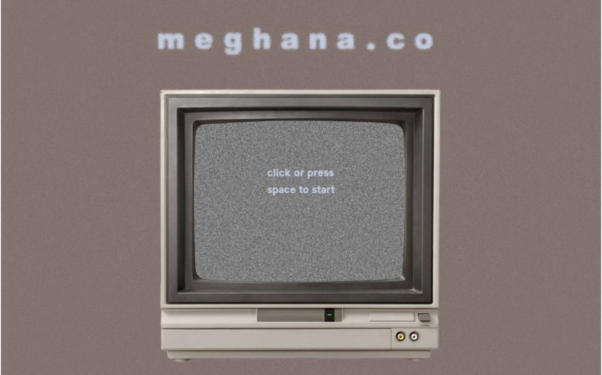

# meghanawebv2
My new personal website, made with Astro and the despair of CSS
> visit at [meghana.co](https://meghana.co)

# Why
I had the vision for a personal website with a staticky TV and terminal-like navigation and decided mine needed a revamp. 
> shout out phthallo's [awesome terminal website](https://terminal.phthallo.com/)        

I've been overdue to learn a framework, so after [@lou](https://github.com/v1peridae) and I spent 3 hours installing Astro on my computer and getting started, I was off to the races. Back in May, I made my website in 7 hours and thought I'd been doing it for 30 years. This time, I've spent 40 hours making this website and it's felt like 5. I had a ton of fun, even though writing my CSS literally took years off my life.   

# How I did it
Astro, mostly. The [photodome](https://meghana.co/photodome) was taken from React Bits' [Dome Gallery](https://reactbits.dev/components/dome-gallery) and so there's a bit of React. The terminal window was made using an HTML form and POSTing the user's input to the current page and evaluating it in the frontmatter, which means that instead of having the site pre-rendered at build time, the page is built on-demand, which basically means this website is super slow to load (in comparison to SSG). Does this pretty much defeat all the benefits of Astro? Probably. Is there a better way to do this? Also probably. But POSTing stuff is super cool and I had fun doing it, so. Yeah.

# Notes
Super proud of my Card.astro and using a json file because that was my primary goal of the new website. Astro props are so awesome. The photodome is also pretty fire and I'm happy with how that turned out. I'd like to add more commands to the terminal and more general easter eggs (maybe an escape room with riddles).
